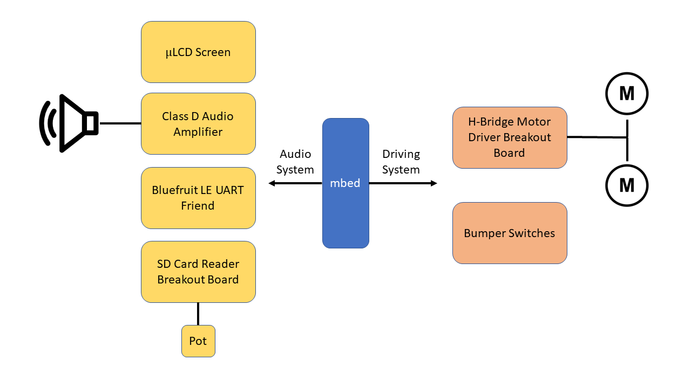

<h1 style="color:black"> DJ Roomba </h1>
## 1. Systems Overview
&emsp;All systems are controlled by the [mbed LPC1768](https://os.mbed.com/platforms/mbed-LPC1768/), which is serving as our primary microcontroller in this project. The robot is powered by two different sets of batteries; a 6 volt battery pack to power the uLCD and bluetooth module, and a 9 volt battery to power the rest of the robot's systems.
### a. WAV Player
&emsp;The WAV player plays WAV files using mbed RTOS, similar to how it's done in lab 3. The wave player's hardware consists of:
- [uLCD screen](https://os.mbed.com/users/4180_1/notebook/ulcd-144-g2-128-by-128-color-lcd/)
- [Class D Audio Amplifier Breakout Board](https://os.mbed.com/users/4180_1/notebook/tpa2005d1-class-d-audio-amp/)
- [SD Card Reader Breakout Board](https://www.sparkfun.com/products/544)
- [Bluefruit LE UART Friend](https://os.mbed.com/users/4180_1/notebook/adafruit-bluefruit-le-uart-friend---bluetooth-low-/)
- Potentiometer for volume control

&emsp;The WAV player loads .wav files on the SD card and uses PWM to transmit the song to the audio amp. Muliple songs are held on the SD card. Songs can be paused or skipped using the Adafruit bluetooth app. When mTrain receives a command from the bluetooth module, it will execute the command, allowing for remote control. Note that the remote control only extends as far as the WAV player functionality.

 <!-- Shows image, div sets the image to center align -->

<b>Figure 1.</b> Control pad on the Bluefruit app. 1 pauses songs, 2 rewinds songs, 3 plas the previous song, 4 plays the next song.

  
&emsp;The uLCD is used to display song progress. It consists of a green bar that progresses with respect to the place in the song, as you would expect from a progress bar.
### b. Room Navigation
&emsp;Additionally, the roomba is able to navigate a room autonomously. The robot moves via wheels attached to DC motors and powered by an h-bridge. It senses it's environment using bumper switches mounted to the front of the chassis. The following parts from the course are used on the robot:
- [Dual TB6612FNG Motor Driver](https://www.sparkfun.com/products/14451)
- [Bumper switches](https://www.pololu.com/product/3674)
- DC motors

&emsp;By default, the robot is set to drive forward. When the robot senses an obstacle (via the bumpers), it turns in the direction opposite of the bumpers that triggered it. For example, if the robot's right set of bumpers make contact with something, it will turn counterclockwise. The robot runs this procedure indefinitely.

## 2. Schematic

<b>Figure 2.</b> Block diagram showing system connections.

## 3. Demo

    <video width="640" height="480" controls>
      <source src="assets/cat_video.mp4" type="video/mp4">
      Your browser does not support the video tag.
    </video> 

<b>Figure 3.</b> Demo video of robot's drive system.

    <video width="640" height="480" controls>
      <source src="assets/media-demo-c.mp4" type="video/mp4">
      Your browser does not support the video tag.
    </video> 

<b>Figure 4.</b> Demo video of WAV player.
